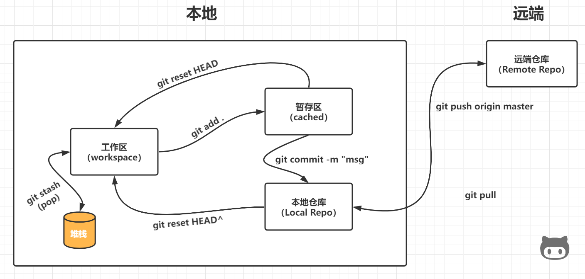
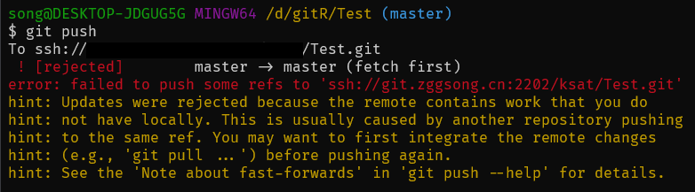
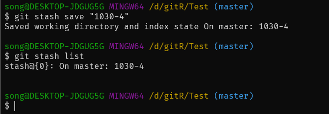
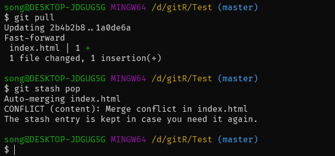
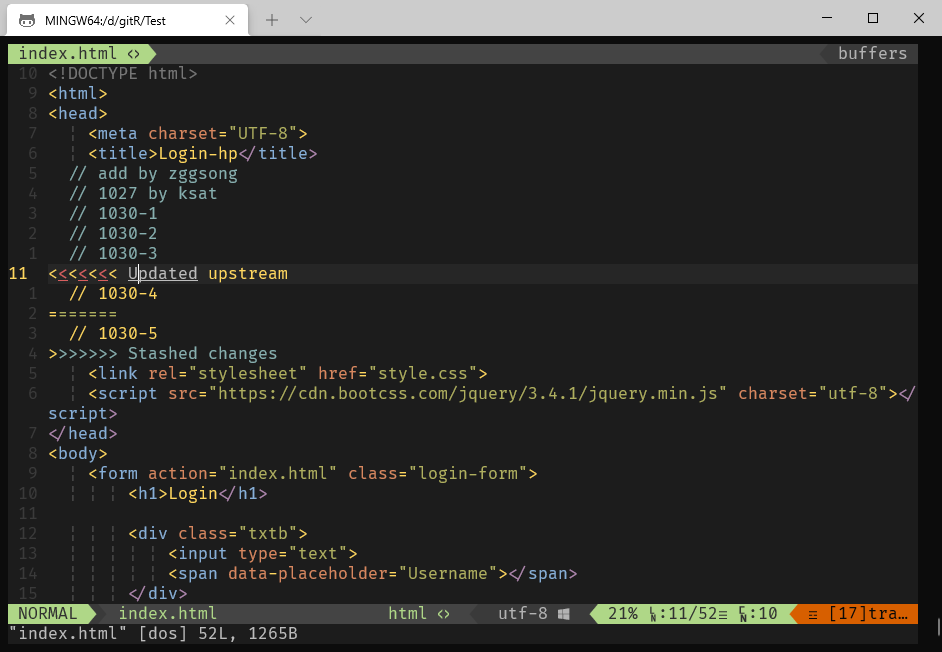

## 基本冲突解决

### 前言

在我们在用 Git 进行多人开发的时候，会遇到没及时拉取最新仓库代码就直接上手写的情况（或者说你正在写，人家就推送了），这种时候我们写好后 push 就会发现无法推送，查看信息可以得知是远端仓库已经有更新了，本地不是最新版，这就产生冲突了。  

### 流程

先放一张整体流程图：


一般的流程都是：
```
git add .
git commit -m "your msg"
git push origin master
```
随后发现报错：

当我们在提交之后就可以使用下面这个命令
```
git reset HEAD^
```
将本地仓库退回至上一个版本，同时将上一次提交的内容退回至工作区  
此时还不可以拉取最新版，**需要先将自己修改过的内容先存到堆栈区**  
然后再从远端仓库拉去最新的版本，最后在**取出堆栈区的文件和拉取的文件对比**

```
git stash [save "your msg"]
git pull
git stash pop
```




  
其中：冲突标记`<<<<<<<`与`=======`之间的内容是别人修改的，`=======`与`>>>>>>>`之间的内容是自己修改的  

最简单的编辑冲突的办法，就是直接编辑冲突了的文件，把冲突标记删掉，把冲突解决即可

### 拓展

在解决这个问题时涉及一些命令：
- `git diff`: 比较工作区和暂存区（如无则为 HEAD）内容
- `git reset HEAD`: 清理暂存区，恢复至工作区
- `git reset --hard HEAD`: 清理暂存区和工作区（**修改内容丢失**）
- `git log`: 查看版本号
- `git reset [版本号]`: 恢复至指定版本
- `git checkout <filenem>`: 若暂存区为空，则直接回复上一个版本（HEAD）的指定文件至工作区


---

## 分支合并冲突

### 前言

更加严谨的来说，再修改时要创建一个新的分支进行修改，修改完成再拉取远端仓库最新版本，再进行合并，有冲突解决冲突，再push，最后在删除开发分支这样一个流程。所以现在就来简单记录分享一下如何解决合并分支冲突。


### 案例

#### 总结
```
# 创建分支 (develop)
git checkout -b dev

# 新分支和本地最新的master分支内容相同，再次进行修改
vim [xxxx.md]

# 在dev分支上add && commit
git add .
git commit -m "commit on dev"

# 切换回master分支并拉去最新代码
git checkout master
git pull origin master

# 合并dev分支至master
 git merge dev

 # 若无冲突直接push
 git push origin master

 # 若有冲突直接打开冲突文件解决冲突再次提交推送即可
 vim [xxxx.md]
 git add .
 git commit -m "resolve conflict"
 git push origin master

# 删除dev分支
git branch -d dev
```

#### 举例

```

song@DESKTOP-JDGUG5G MINGW64 /d/gitR/Test (master)
$ git checkout -b dev
Switched to a new branch 'dev'

song@DESKTOP-JDGUG5G MINGW64 /d/gitR/Test (dev)
$ vim index.html

song@DESKTOP-JDGUG5G MINGW64 /d/gitR/Test (dev)
$ git add .

song@DESKTOP-JDGUG5G MINGW64 /d/gitR/Test (dev)
$ git commit -m "zggsongadd3ondev"

[dev 5c28c74] zggsongadd3ondev
 1 file changed, 1 insertion(+)

song@DESKTOP-JDGUG5G MINGW64 /d/gitR/Test (dev)
$ git checkout master
Switched to branch 'master'
Your branch is up to date with 'origin/master'.

song@DESKTOP-JDGUG5G MINGW64 /d/gitR/Test (master)
$ git pull
remote: Counting objects: 5, done.
remote: Compressing objects: 100% (3/3), done.
remote: Total 3 (delta 1), reused 0 (delta 0)
Unpacking objects: 100% (3/3), 293 bytes | 16.00 KiB/s, done.
From ssh://git.zggsong.cn/ksat/Test
   cbf451e..294d107  master     -> origin/master
Updating cbf451e..294d107
Fast-forward
 index.html | 1 +
 1 file changed, 1 insertion(+)

song@DESKTOP-JDGUG5G MINGW64 /d/gitR/Test (master)
$ git merge dev
Auto-merging index.html
CONFLICT (content): Merge conflict in index.html
Automatic merge failed; fix conflicts and then commit the result.

song@DESKTOP-JDGUG5G MINGW64 /d/gitR/Test (master|MERGING)
$ vim index.html

####### Conflict Content ######
<<<<<<<HEAD
  // add by ksat3
=======
  // add by zggsong3
>>>>>>> dev
####### Conflict Content ######

song@DESKTOP-JDGUG5G MINGW64 /d/gitR/Test (master|MERGING)
$ git add .

song@DESKTOP-JDGUG5G MINGW64 /d/gitR/Test (master|MERGING)
$ git commit -m "resolve conflict on zggsong"
[master 03a1211] resolve conflict on zggsong

song@DESKTOP-JDGUG5G MINGW64 /d/gitR/Test (master)
$ git push origin master
Enumerating objects: 10, done.
Counting objects: 100% (10/10), done.
Delta compression using up to 8 threads
Compressing objects: 100% (6/6), done.
Writing objects: 100% (6/6), 632 bytes | 632.00 KiB/s, done.
Total 6 (delta 2), reused 0 (delta 0), pack-reused 0
remote: . Processing 1 references
remote: Processed 1 references in total
To ssh://git.zggsong.cn/ksat/Test.git
   294d107..03a1211  master -> master

song@DESKTOP-JDGUG5G MINGW64 /d/gitR/Test (master)
$ git branch -d dev
Deleted branch dev (was 5c28c74).

song@DESKTOP-JDGUG5G MINGW64 /d/gitR/Test (master)
$
```