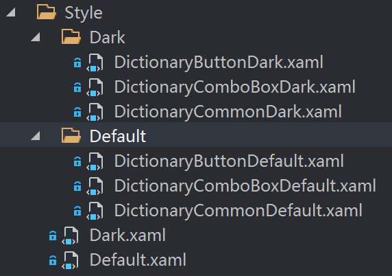

## 前言

最近在 Windows 上开发的时候发现我太习惯用 Mac 上的一款翻译软件 Bob 非常方便，在 win 上我还没有找到类似的软件，既然我会写点 WPF 那就自己写一个吧。花了几天写了一个简单的实现划词翻译的功能，在家优化的时候女朋友来了句：“怎么就一个颜色，要是能变色就好点”。好吧，我还没有尝试过，这就试试主题切换。

其实，写 WPF 的时候好多时候偷懒 Style 写在控件里面，这样不方便切换，理论上只要将所有 Style 提取到资源字典里，在给个按钮去切换不同主题的资源字典就可以实现主题切换功能，本质上实现起来很简单，本文仅记录。

> 小工具已开源 | [Github](https://github.com/ZGGSONG/STranslate) | [Release](https://github.com/ZGGSONG/STranslate/releases/)

## 操作

### 构建主题资源字典

这一步比较冗杂无聊，无非提取 Style 切换颜色，也不知道是否标准，我整理的文件结构大概如图所示



### 加载切换主题资源字典

整理完分割完资源字典以后就是动态加载的问题：
1、 修改资源引入方式为动态资源
2、 MVVM 绑定切换动作

#### 动态资源

切换主题是需要动态修改的控件引入 style 的方式需要修改为 DynamicResource，如

```XAML
<TextBox x:Name="TextBoxOutput"
		Style="{DynamicResource TextBoxOutputStyle}"
		Text="{Binding OutputTxt}"/>
```

#### 绑定切换动作

```C#
Application.Current.Resources.MergedDictionaries[0].Source =
	Application.Current.Resources.MergedDictionaries[0].Source
	.ToString() == ThemeDark ? new Uri(ThemeDefault) : new Uri(ThemeDark);

private const string ThemeDark = "pack://application:,,,/STranslate;component/Style/Dark.xaml";
private const string ThemeDefault = "pack://application:,,,/STranslate;component/Style/Default.xaml";
```

## 额外

### 图标

由于涉及不同主题的图标，就不适合在下载 png、jpg 文件引入了，毕竟主题好看与否得一点点调试，最好还是下载 iconfont 字体文件，然后通过 textblock 的方式引入，只需要调整 forceground 即可，这样根据主题微调不同控件颜色就比较方便了。

> 举个例子，在 [阿里巴巴矢量图标库](https://www.iconfont.cn/) 中将图标添加至项目中，下载至本地，将 iconfont.ttf 添加到项目中，根据上一步下载文件中 html 中图标的代码引入图标即可

```XAML
<!--引入字体文件-->
<Style x:Key="IconStyle" TargetType="TextBlock">
	<Setter Property="FontFamily" Value="/STranslate;component/Images/#iconfont"/>
</Style>

<TextBlock Style="{StaticResource IconStyle}"
		   FontSize="21"
		   VerticalAlignment="Center"
		   Text="&#xe637;"
		   Foreground="#af67c1"/>
```

### SVG

在上一步引入图标的时候，我发现想找到自己想要的图标是真的比较困难，所以我还是决定自己来画 (pin) 吧，可能是我电脑上的 ps 有点问题，根据 [阿里巴巴矢量图标库的方法](https://www.iconfont.cn/help/detail) 要么生成效果有问题，要么无法生成 SVG   
我是用的是随便找的一款 [在线 ps 工具](https://www.tuyitu.com/ps/sources/)，首先找到自己想要的 SVG 原图，就直接去 [ICONFINDER](https://www.iconfinder.com/) 或者别的地方找就行了，然后打开想要的直接留想要的，拼积木就好了

> 测试发现需要使用[阿里巴巴矢量图标库](https://www.iconfont.cn)下载的图标拼接才能实现拼图，否则上传至阿里云矢量图库时拼接部分不显示
