> 买正版、买正版、买正版

## 前言

当初入手华强北 Airpods 的时候，还在用这小米 8，体验一年下来，整体感受真的可以。但是后来我为什么还是要入手正品呢？还不是入手了 iPhone 了嘛，真香！@（滑稽）

## 对比
设备  |  华强北  |  正品
| :-- | :-- |  :-- |
入手平台| 某鱼  | PDD
价格  |  ¥300  | ¥830(-80 无门槛）@（你懂的）
使用  | 整体用着还可以，电量有时耐 c，有时尿崩，最后盒子充不上电了@（喷）（商家在我购买后一周内就关门大吉了） | 还可以，用了一个月出现过一次无故断链，一次微信电话无法切回放歌
优点  | 便宜！便宜！便宜！ | 稳定，低延迟，苹果全家桶切换方便

对比图 |  说明
:-- | :-- |  :-- 
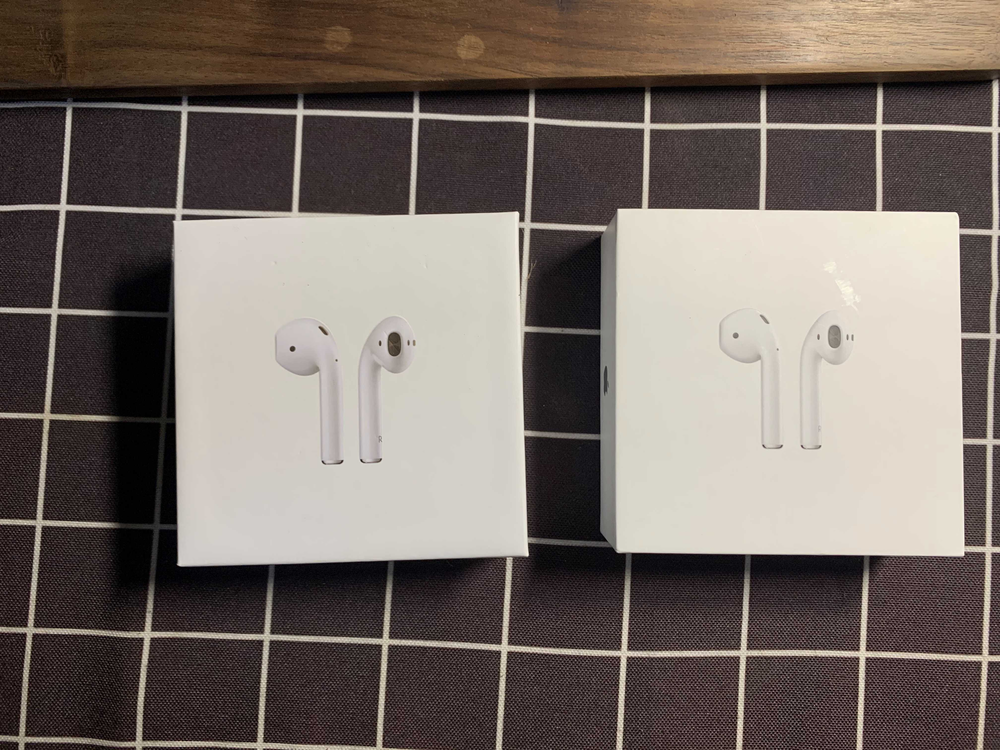 | 正面不仔细看差别不大
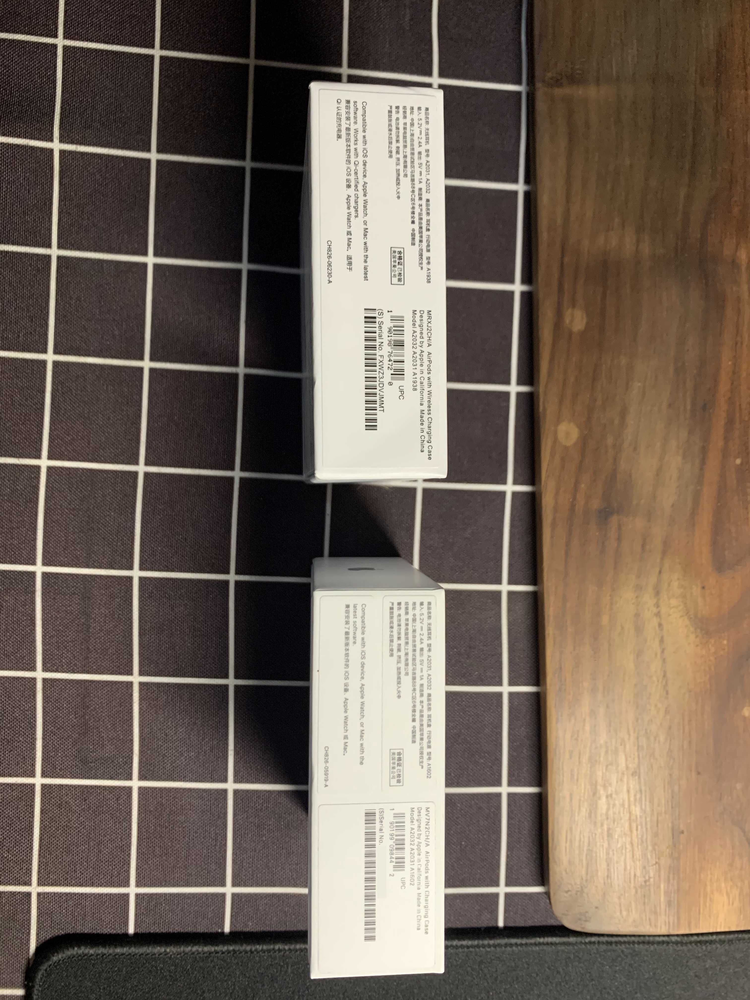 | 侧面字体颜色明显不同
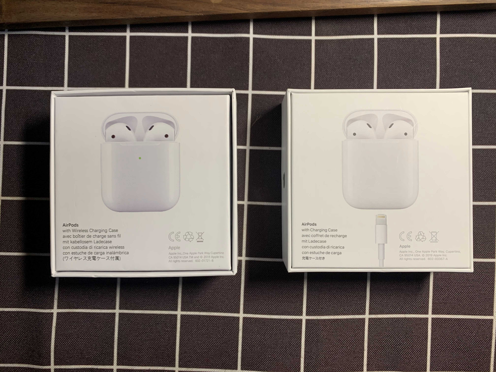 | 背面一下就能看出来了，做工差距太大了
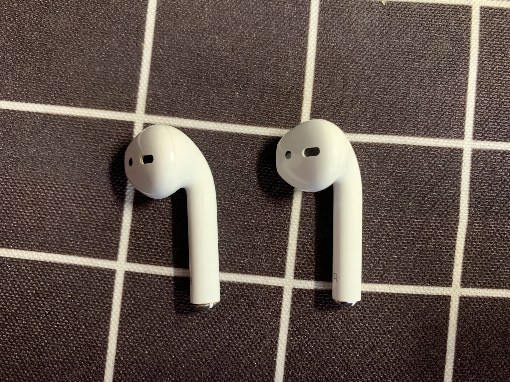 | 耳机本体（左假右真）
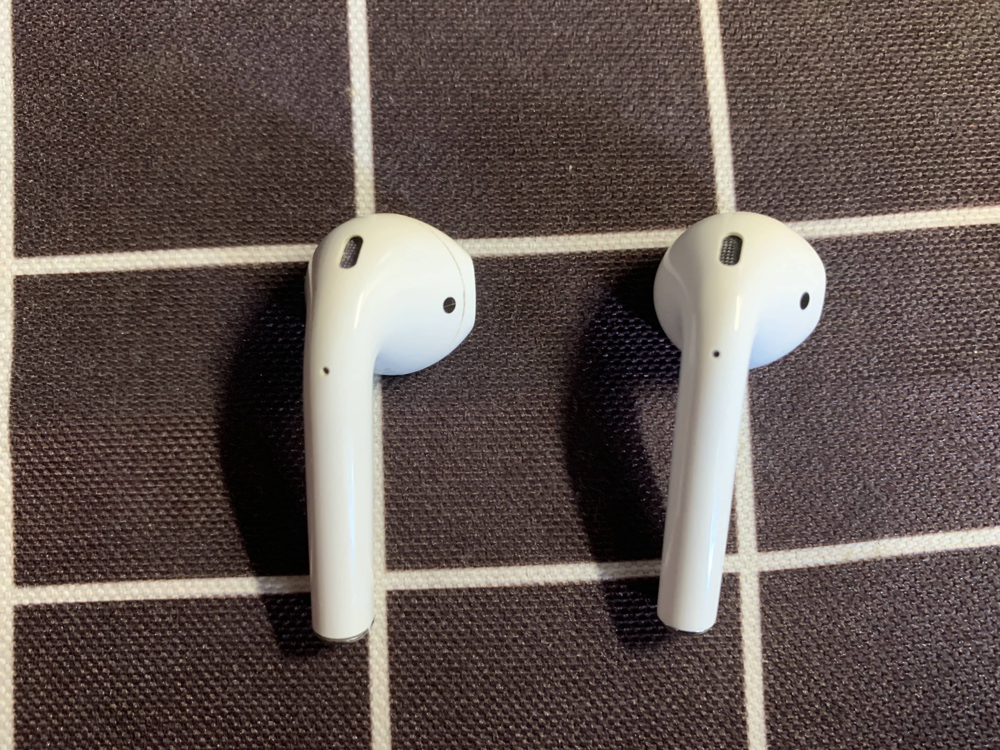 | 耳机本体（左假右真）
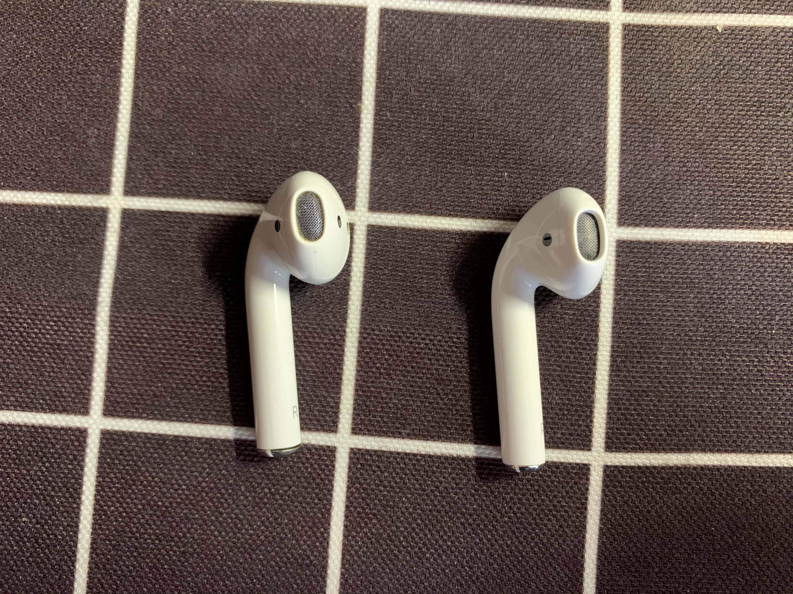 | 耳机本体（左假右真）
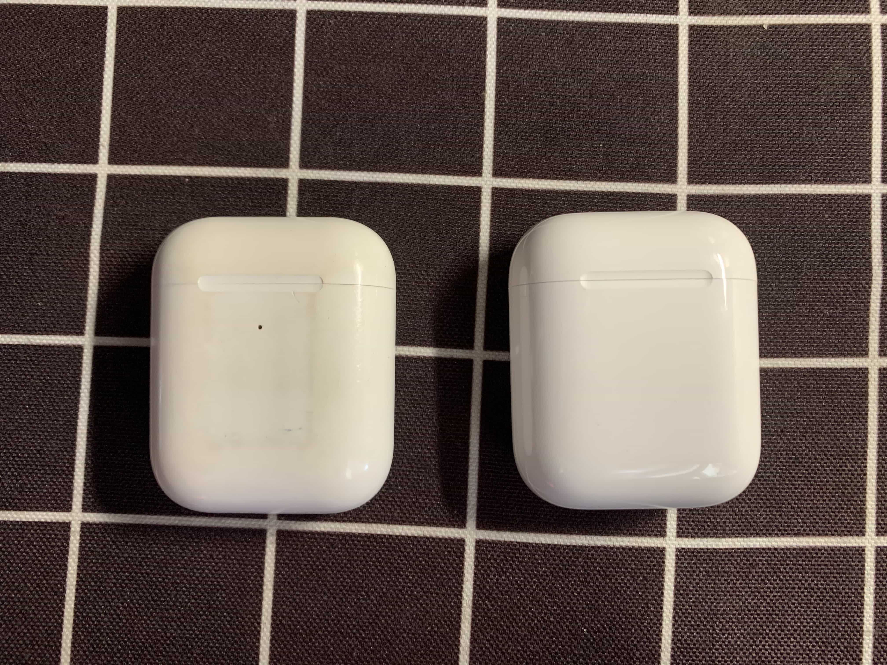 | 充电盒，华强北的还是防无线充电盒
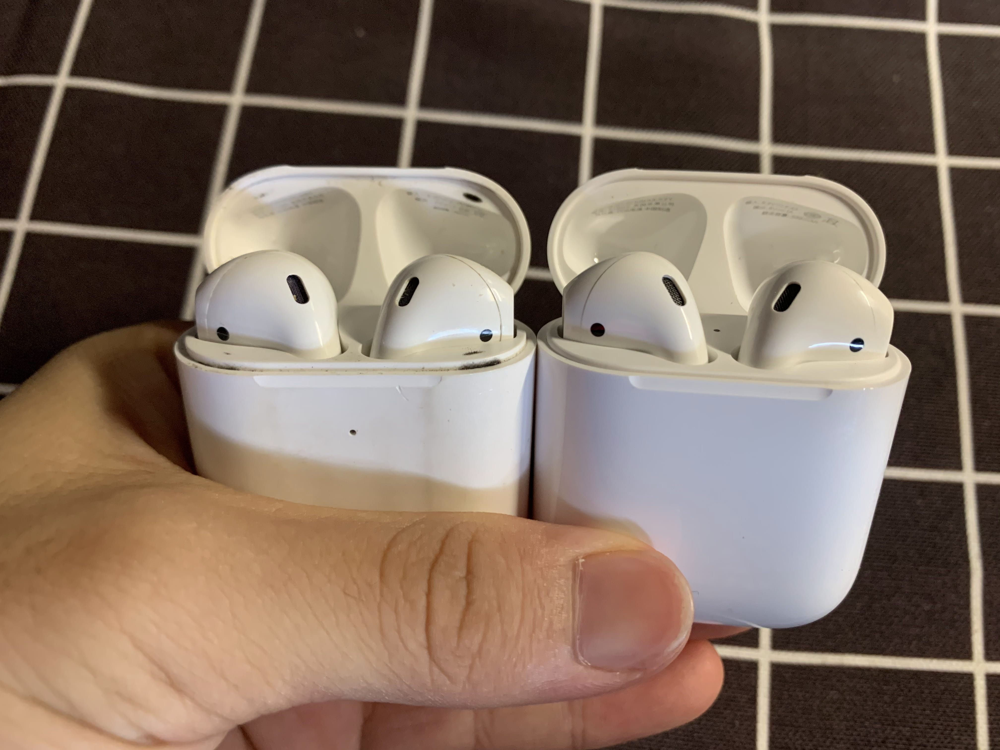 | 开盖对比

## BB

我自己也不是真正的发烧友（主要是钱包不允许我发烧#（无奈）），也是个木耳，音质这玩意，太玄学，但是跟所有出门挂个有线耳机的同仁一样，就想听个歌，但是有线太麻烦，想要追求无线化，1k 多的售价，对于学生党来说，还是有点高，好在 PDD 给力呀#（击掌）。想当初也存钱买过 AKG Y50（头戴式有线）、索尼 MDR-XB950B1（头戴式蓝牙）、捷波朗 45e（挂脖式）  

**遗照：**

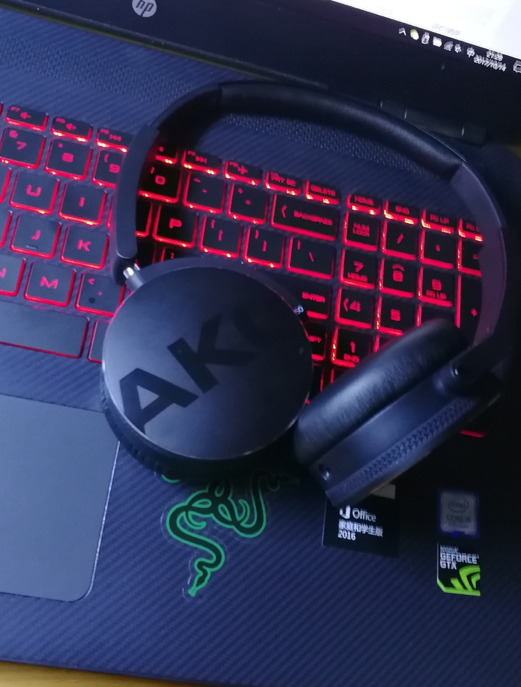

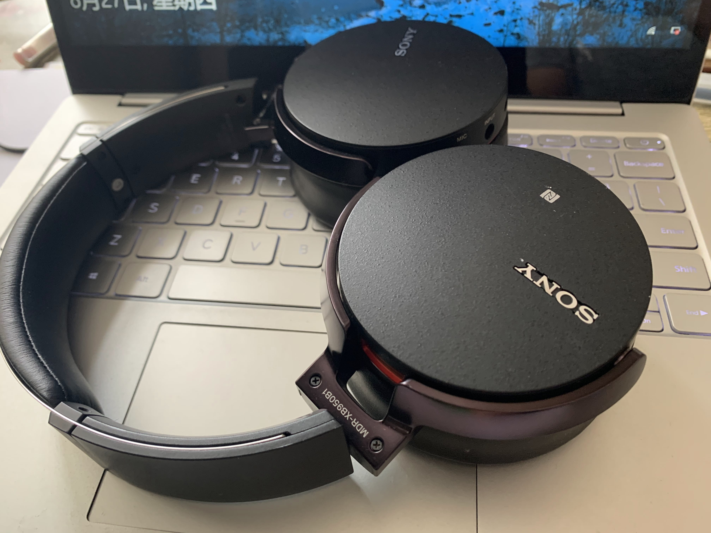

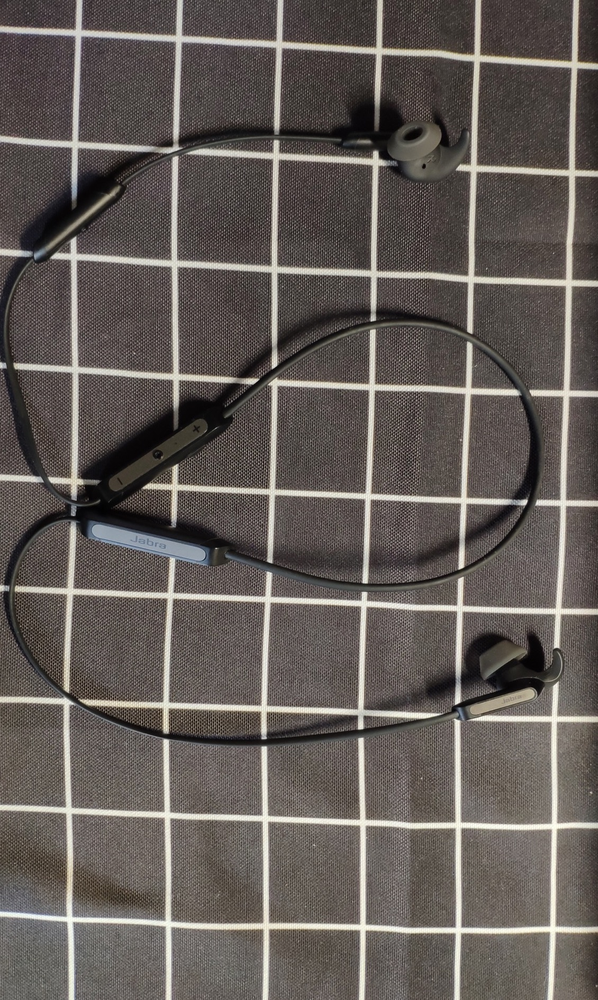

以上这些耳机或咸鱼出掉或送人，主要是没有解决掉兼顾我日常使用，方便携带，偶尔运动等方面的需求，最后再买的 Airpods，就是刚刚好，大多数人应该和我一样，没有那么的在乎音质，AirPods 实实在在解决了我们的痛点，我想着也是这款 TWS 耳机能这么成功的原因吧。
选购耳机的路上，踩过很多坑，已经爬出来了（以后工作了再入坑#（肿包））。耳机，适合自己的才是最重要的！

## 问题

> 在后续的使用中，发现两只耳机电量总是不一致，有时甚至一只耳机没电关机了，另一只耳机还有 20 多的电量

这个原因是在于开启了自动选择麦克风，先戴的那只耳机将被设定为主耳机，启用其麦克风进行收音，因此会更加耗电。
