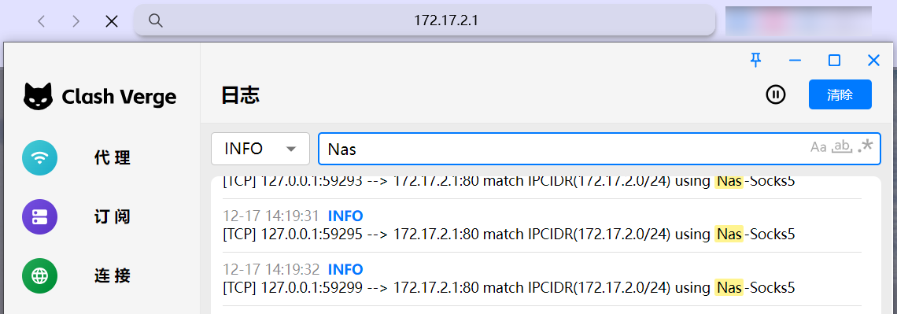
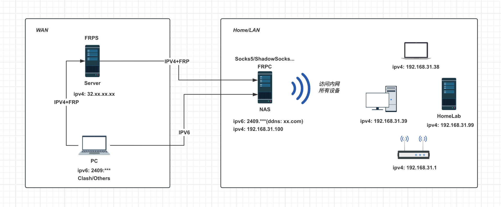
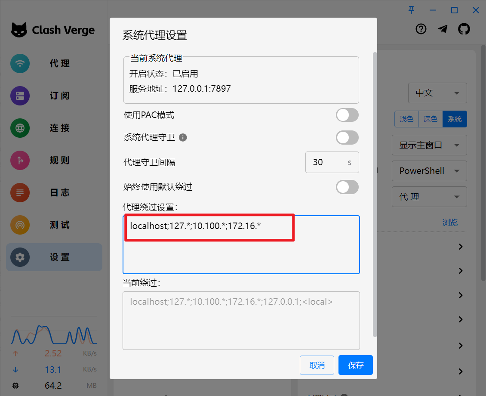
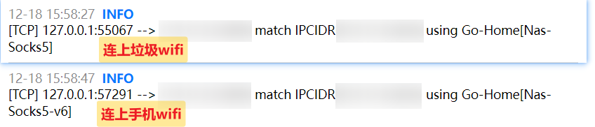

分享一下我目前在用的回家方案，用的很舒服且稳定，如果你平时也习惯挂着代理，那这个方案就很适合你。

## 演示

外部网络直接访问内网地址



## 架构图

> 排除 `IPV4+FRP` 则为基础方案



## 基础方案

1. 公网 IP(v4/v6)
2. 日常使用代理工具 (Surge/Clash verge/ShadowRocket/...)

## 原理

1. 家庭网络搭建节点服务端
2. 通过 ddns 方式使外部成功访问
3. 外部设备添加家庭网络节点
4. 外部设备配置家庭局域网网段使用该节点访问
5. 外部设备删除本地网段中你所使用家庭网段跳过使用代理

> 搭建 `socks5` 的流程就不演示了，网上一搜有很多，我用的是 `yarmak/socks5-server`[^1] 镜像，有需要的可以去看`不良林的视频`[^2]，创建完服务后再代理软件中配置节点和分流规则即可

### Windows-Clash verge 配置

#### 配置代理

添加你的家庭网络节点到 Clash 配置中去

```yml
# 你的配置。..

proxies:
  - name: Nas-Socks5
    type: socks5
    server: #your ddns domain
    port: #your port
    username: #your username
    password: #your pwd

# 你的配置。..

rules:
  #user rules
  #指定你家里的网段使用上面你定义的节点访问
  #no-resole: Clash 不会对该规则进行 DNS 解析
  - IP-CIDR,192.168.31.0/24,Nas-Socks5,no-resolve

# 你的配置。..
```

#### 移除内网网段跳过代理

`Clash Verge`-` 设置 `-` 系统设置 `-` 小齿轮 `- 关闭 ` 始终使用默认绕过 `- 将 ` 当前绕过内容复制到 ` ` 代理绕过设置 ` 里面去并删除你家庭网段所在的 IP 段即可

==最主要的是将代理绕过设置中的你家庭网段移除==



---

问题：发现 Win11 上 ` 设置 `-` 网络和 Internet`-` 代理 `-` 手动设置代理 `-` 使用代理服务器 ` 中不更新实际代理配置信息

方案：可以直接通过注册表查看信息：` 计算机 \ HKEY_CURRENT_USER\Software\Microsoft\Windows\CurrentVersion\Internet Settings`

- `ProxyEnable`: 是否使用代理服务器
- `ProxyServer`: 代理服务器配置
- `ProxyOverride`: ==绕过代理配置 （重要）==

## 进阶方案（多节点回家）

由于当前国内网络宽带运营商基本都支持了 IPV6, 所以回家的方式有用这种很快，但是有的地方比如公司路由器很大概率没有 IPV6, 就需要搭建 IPV4+FRP 的方式来进行转发了

1. IPV4（云服务器）+FRP 转发
2. IPV6+DDNS 直连

随后可以使用 Clash 中的 proxy-groups 配合自动回退 (fallback) 功能来使用这两个节点，配置步骤还是如上 [配置代理](#配置代理), 修改后的配置放到最后

解释一下内容则是配置两个节点 (v4 和 v6) 分别可以访问家里的 socks5 服务器，创建一个组叫做 `Go-Home`, 类型为 `fallback`,proxies 设置为刚配置过的节点名称，比如我希望首选 ipv6, 毕竟是直连，如果 ipv6 走不通才选 ipv4+frp 中转，其中用于测试节点可用性的 url 需要注意选择 ==同时支持 ipv4 和 ipv6==

> fallback: 在 proxy-groups 部分，fallback 类型的代理组会按照预定义的顺序依次尝试不同的代理服务器，直到找到一个可用的代理并将其用于当前请求

```yml
# 你的配置。..

proxies:
  - name: Nas-Socks5
    type: socks5
    server: #your server
    port: #your port
    username: #your username
    password: #your pwd
  - name: Nas-Socks5-v6
    type: socks5
    server: #your server
    port: #your port
    username: #your username
    password: #your pwd

proxy-groups:
  - name: Go-Home
    type: "fallback"
    url: "https://www.apple.com/library/test/success.html" #! 此处需要使用同时支持 ipv4、ipv6 的测试 url
    interval: 300
    proxies:
      - Nas-Socks5-v6
      - Nas-Socks5
# 你的配置。..

rules:
  #user rules
  #此处使用 Go-Home 组
  #no-resole: Clash 不会对该规则进行 DNS 解析
  - IP-CIDR,192.168.31.0/24,Go-Home,no-resolve

# 你的配置。..
```

示例图片



## 参考文章

- [不良林 - 通过 ss、vmess 等代理协议访问家庭内网 NAS 服务](https://bulianglin.com/archives/gohome.html)
- [Clash.Meta Docs #自动回退](https://hokoory.github.io/clash-mate-doc/config/proxy-groups/fallback/#_2)
- [检查网络延时测试 URL 汇总，可用于软件测试延时](https://blog.baicai.me/article/2023/urltest-urltest/)
- [Frp 官方文档 - TCP & UDP](https://gofrp.org/zh-cn/docs/features/tcp-udp/)

[^1]: https://hub.docker.com/r/yarmak/socks5-server
[^2]: https://youtu.be/ncT4LqZe1-Y
