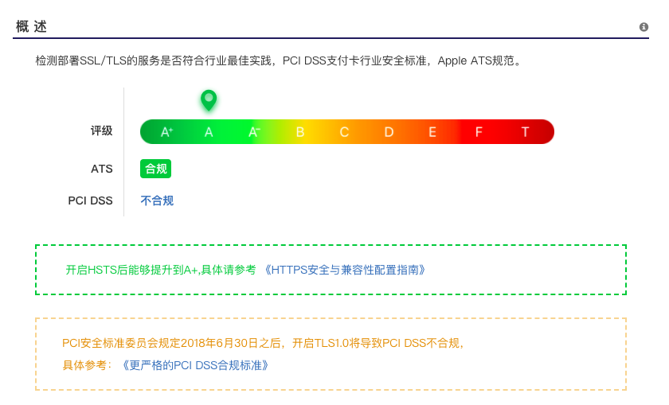
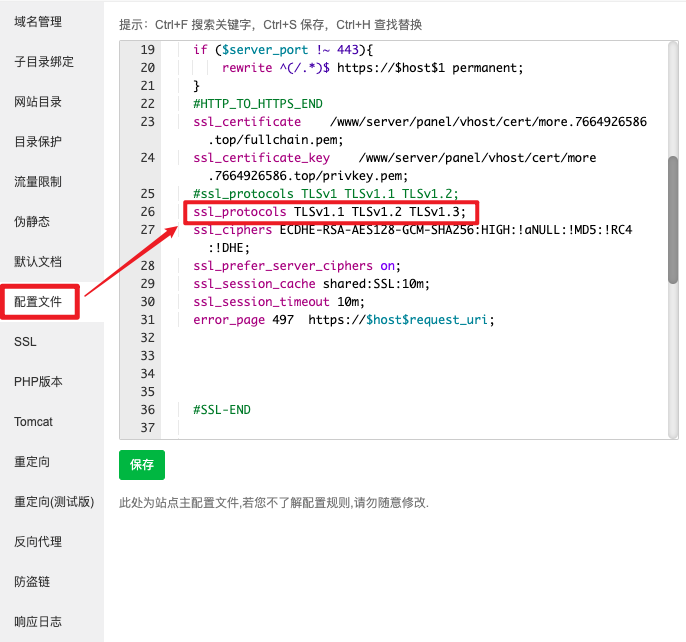
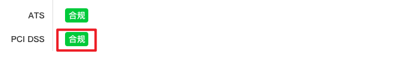
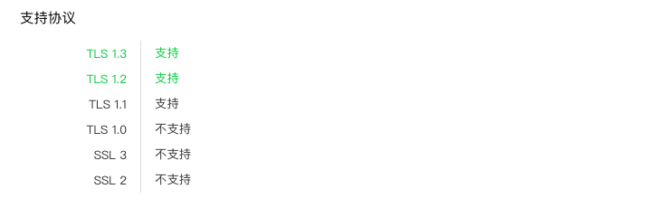
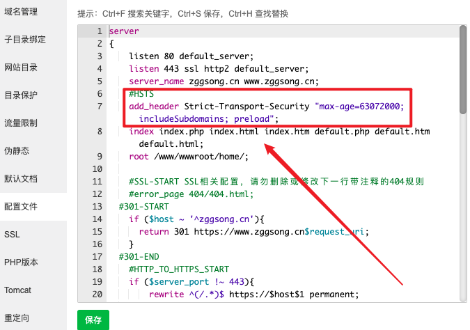
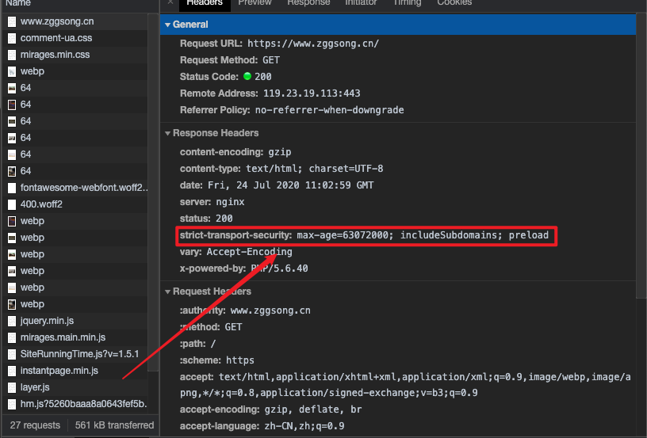
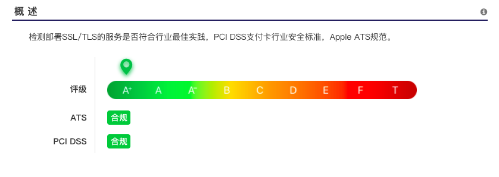

## 前言

为什么我要开启 HSTS 和 TLSv1.3 呢？

[网站安全监测](https://myssl.com)

作为一个资深强迫症患者，忍不了了！开整~

## 介绍

- TLS1.3
  - 简介：TLS 1.3 加密协议是在 TLS 1.0 、TLS 1.1 、TLS 1.2 之前版本基础上进行的升级和改造
  - 作用：加快访问速度、提升安全性
  - 详情：[点击查看](https://zhuanlan.zhihu.com/p/32987630)
- HSTS
  - 介绍：HSTS(HTTP Strict Transport Security) 是国际互联网工程组织 IETF 发布的一种互联网安全策略机制。采用 HSTS 策略的网站将保证浏览器始终连接到该网站的 HTTPS 加密版本，不需要用户手动在 URL 地址栏中输入加密地址，以减少会话劫持风险。
  - 详情：[点击查看](https://zhuanlan.zhihu.com/p/25537440)

## 开启 TLS1.3

本人使用的是 CentOS7.4 + 宝塔面板 7.2 + Nginx1.1.5，**实测 Nginx1.1.2 无法开启 TLSv1.3**
==速度真的快了很多==

- 宝塔面板修改 Nginx 版本为 1.1.5
- 点击修改`网站`-`配置文件`（非宝塔用户可直接修改`/usr/local/nginx/conf/nginx.conf`)
- 找到`ssl_protocols`，在末尾添加 TLSv1.3，删除 TLSv1

- 回到 [Myssl](https://myssl.com) 刷新报告即可看见

## 开启 HSTS

- 点击修改`网站`-`配置文件`（非宝塔用户可直接修改`/usr/local/nginx/conf/nginx.conf`)
- 添加`add_header Strict-Transport-Security "max-age=63072000; includeSubdomains; preload";`即可

- 然后查看控制台信息，头部就已经包含 HSTS 信息了

- **舒服了**

## 参考链接

- [知乎-开启 TLS 1.3 加密协议，极速 HTTPS 体验](https://zhuanlan.zhihu.com/p/32987630)
- [知乎-HSTS 详解](https://zhuanlan.zhihu.com/p/25537440)
- [夜半观星-使用宝塔面板开启 TLSv1.3](https://www.ratodo.com/article/bt-tls1-3.html)
- [大鸟博客-启用 HSTS 并加入 HSTS Preload List-附删除 HSTS 方法](https://www.daniao.org/3270.html)
- [yodouyudou-网站开启 HSTS 且强制跳转 HTTPS 访问的方法](https://www.yudouyudou.com/jiaochengheji/wangzhanjianshe/1479.html)
