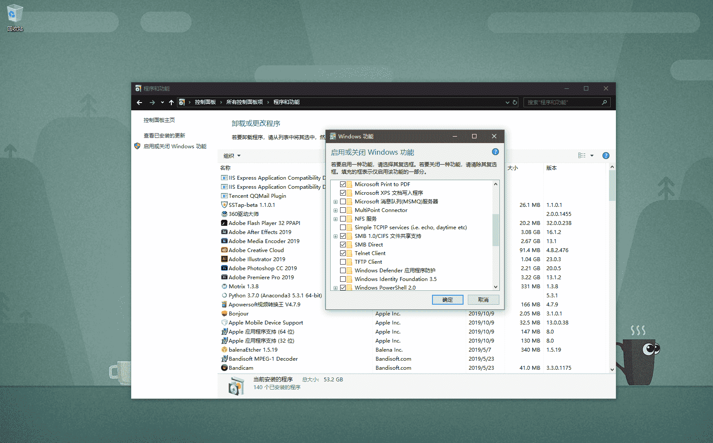
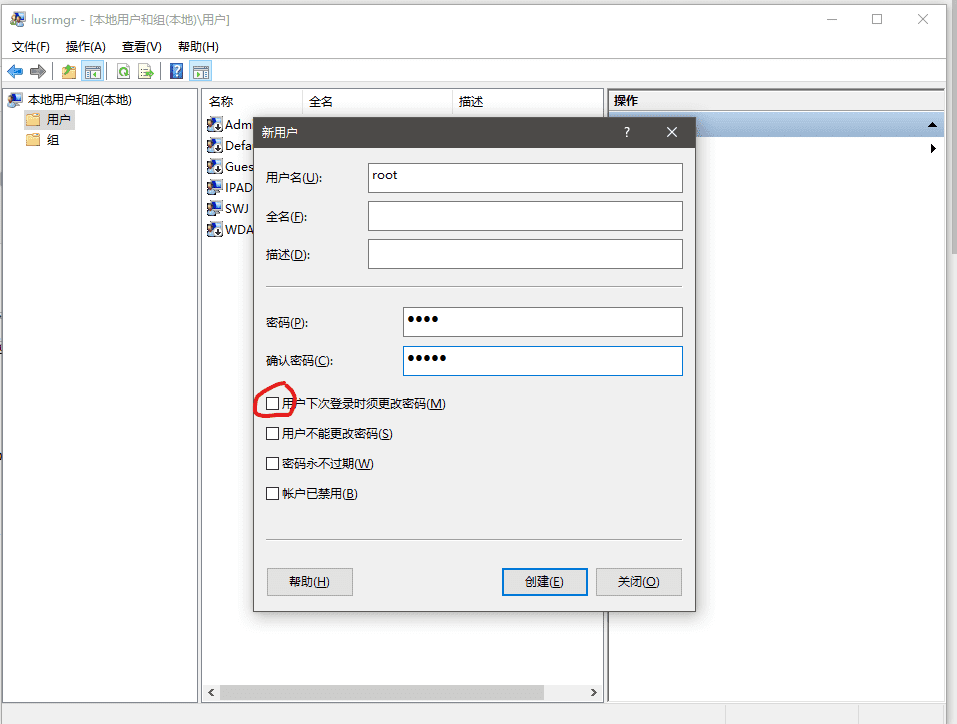
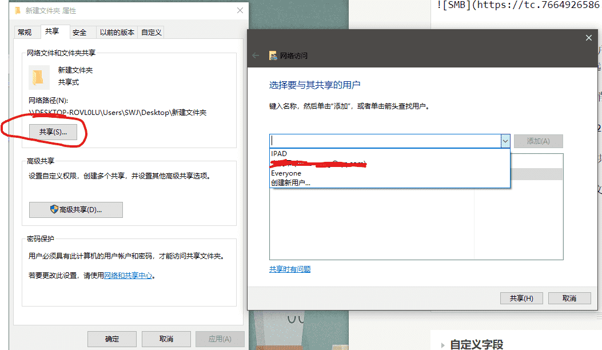
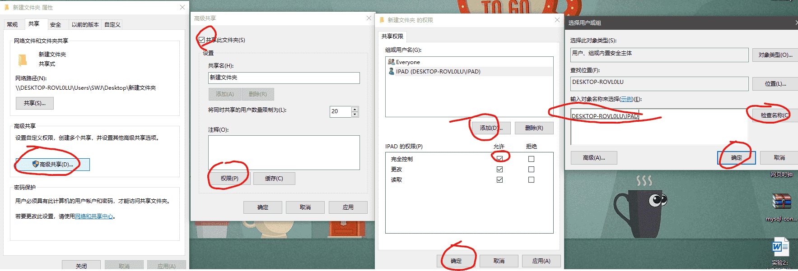
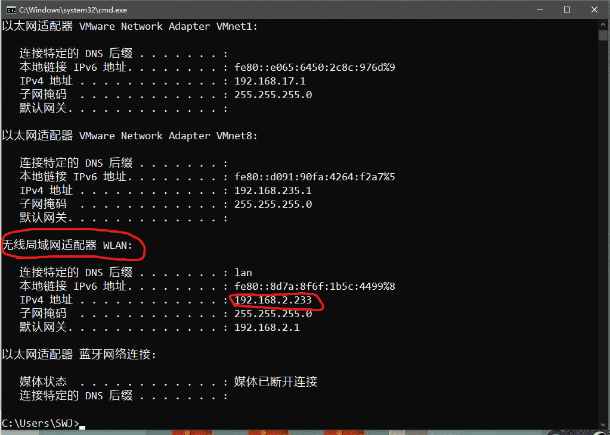

## 前言

最近入手了一台 ipad 2018 32G 版本，内存太小，很多文件也就没有往里面存，平时在宿舍使用，大文件大都在电脑上，共享文件就显得尤为重要了。AND iPad OS 13 文件系统里面也有一个"连接服务器"选项。所以，开整。

## 连接 windows

这边主要也就介绍一下如何使用 windows 共享文件

- Windows10，由于系统默认关闭了 SMB1.0 的服务，第一步必然是将其打开。
  - 控制面板-程序和功能-启用或关闭 Windows 功能-勾选 SMB1.0/CIFS***  开启后重启即可

- 创建一个专门用来共享文件的账户
 - win+r 键-输入 lusrmgr.MSC-选中用户-中间栏空白处右键创建新用户即可

**一定记得取消勾选用户下次登录时更改密码**

- 在一个熟悉的地方创建一个用来共享的文件夹

  - 比如：桌面空白处右键-新建文件夹-右键此文件夹-属性-共享-共享选项-下拉菜单选择刚刚创建的用户名-并修改权限问读取和写入

  - 回到上级目录-点击高级共享-权限-添加-在下面空白框输入用户名-点击检查-添加-勾选完全控制选项

- 查看电脑 ip 地址
  - win+r-输入 cmd-输入 ipconfig

- 正式连接
 - 打开 ipad-进入文件-连接服务器-服务器地址输入：smb://你的 ip-用户名密码填写你之前输入的-连接即可
