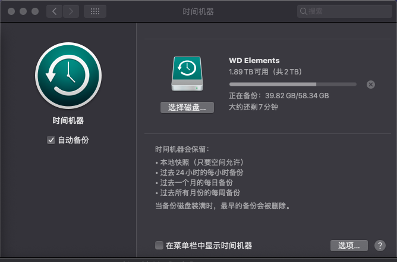

## 前言

Mac 每次备份时长都十分感人，主要原因是，mac 为了保证用户的正常使用，限制了时间机器对磁盘和网络的占用。对于我来说，没有 NAS，只想快速备份，然后拔掉移动硬盘。

## 解决

打开终端，输入下面代码即可解除限制

```shell
sudo sysctl debug.lowpri_throttle_enabled=0
```

备份完成，恢复限制（保证后续备份不影响电脑正常使用）

```shell
sudo sysctl debug.lowpri_throttle_enabled=1
```

解除之前是 4 小时，解除限制之后就 10 分钟


