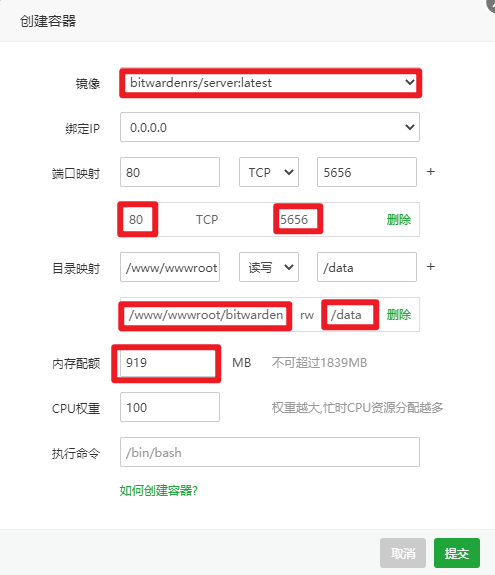
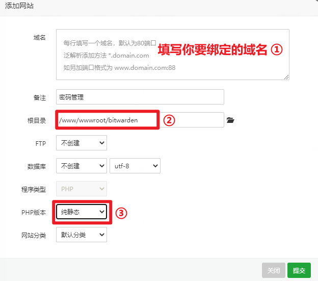
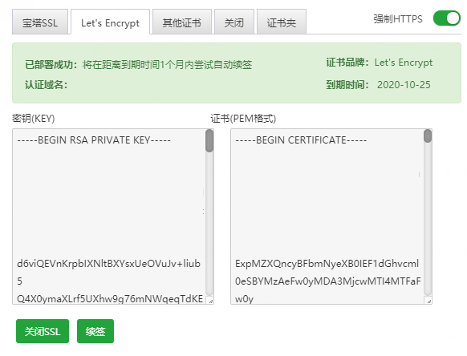
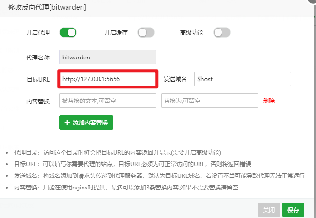
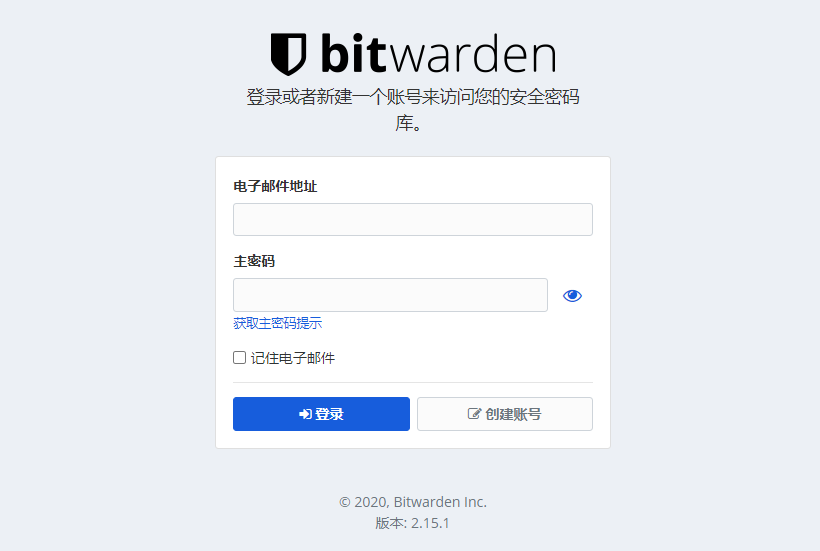
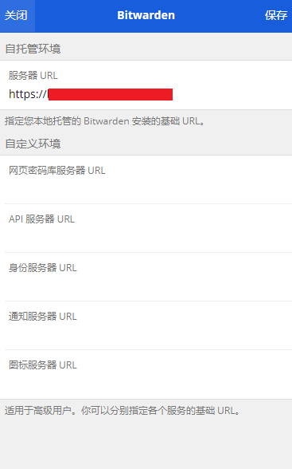
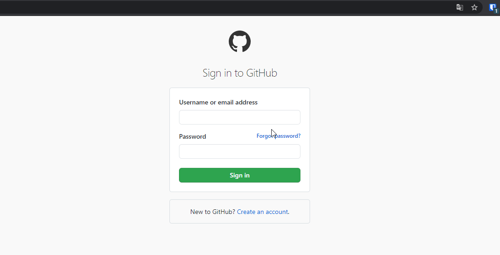
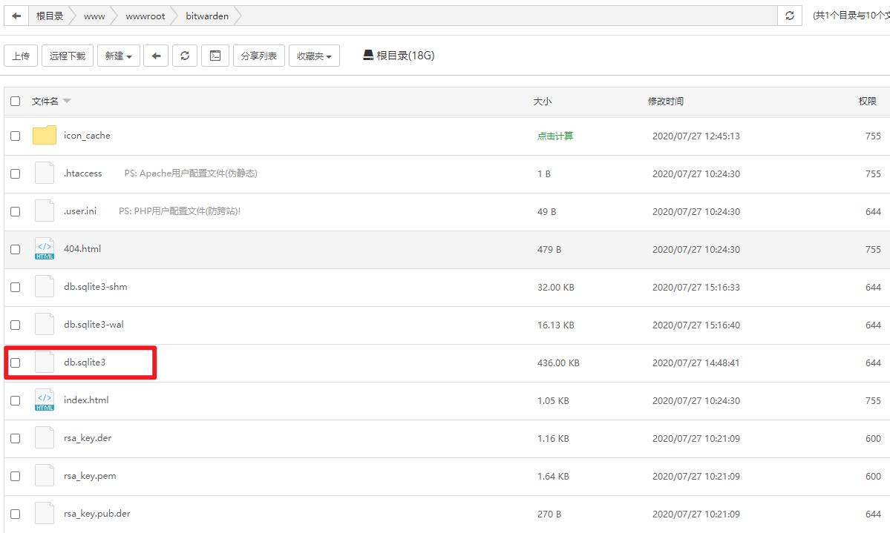
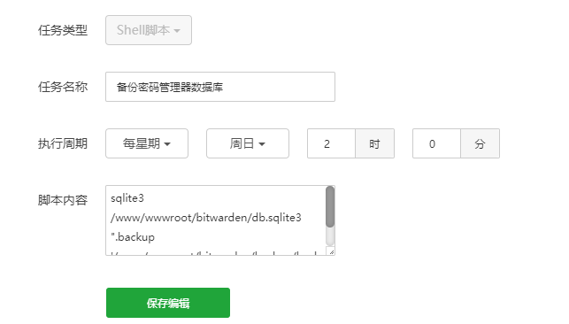
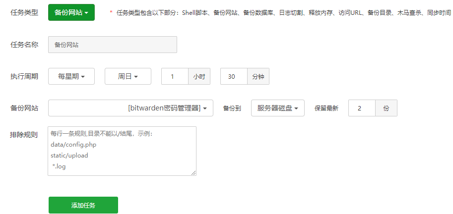

## 前言

密码管理这件事从我小学申请到 QQ 号之后就意识到是个问题，那个时候还停留在纸笔记录，虽说方法原始，但也很有用，就是安全性嘛。后来使用小米账号同步在加密便签里，首先就是同步问题，总是忘记更新密码，等了好久再进去就忘了。再后来习惯了使用 Google Chrome 就把密码保存在 Google 云端，虽说目前为止没啥毛病，甚至还有点方便，但还是莫名心慌。原本想自己写一个密码管理器，后来找了找，轮子都有了，那就算了@（笑尿）

个人使用要求：
- 开源免费（早就听说过 1Password，听说很好用{yaoqian})
- 跨平台
- 安全
- 方便管理

最终找到了`Bitwarden`，虽然 Bitwarden 提供注册，通过他们自己的服务器还保存管理你的密码，但是哪有放在自己服务器上心里踏实#（不出所料），并且 Bitwarden 支持 docker 安装，那岂不是美滋滋。

## 部署

### 1、宝塔安装 docker

这个就不用多介绍了吧，有手就行

### 2、获取镜像

打开`docker 管理器` - `镜像管理` - `官方库` - `bitwardenrs/server` - `获取镜像`

### 3、创建容器

- 创建容器
- 镜像选择`bitwardenrs/server:latest`
- 端口映射：`容器端口`: `80`，`服务端口`: `5656`（随便设置，但是需要在安全选项卡打开此端口） => 点击加号添加
- 目录映射：可以用域名绑定（后面介绍）的目录作为`服务器目录`： `/www/wwwroot/bitwarden`，`容器目录`: `/data`  ==点击加号添加==
- 内存：按推荐的就好
- 提交 


### 4、绑定站点

- 域名绑定服务器 ip - 宝塔添加站点 - 填写相关信息 - PHP 选择`纯静态`其他默认即可



- 随后设置 SSL 证书即可（可以直接在宝塔申请，也可以在别的地方申请填入证书和密钥即可），并开启强制`HTTPS`



- 开启反向代理，目标 URL:`http://127.0.0.1:5656`修改为自己设置的`服务端口`



### 5、完成

访问域名即可打开此页面，随后注册即可

> 注意：若注册是发生意外，那请更换除`Google Chrome`外的浏览器注册



## 使用

这是指简单介绍一下 Google Chrome 通过浏览器插件的是使用吧，其他平台也有对应的应用，方法类似，进入官方 [下载页面](https://bitwarden.com/download/)

- 下载插件
- 点击插件插件-设置-填写所绑定的域名-登陆即可

> Android、iOS、PC、MacOS 下载对应应用程序绑定你自己的域名登陆即可



自动填充



## 关闭注册

既然是自己使用的，那注册功能就可以关闭掉了

方法：关闭并删除此容器 - 然后运行 ssh 连接服务器执行如下命令 (SIGNUPS_ALLOWED=false 表示禁止注册）

> 注意修改：`/www/wwwroot/bitwarden/`和`5656`为自己设置的目录和端口

```shell
docker run -d --name Pwd \
  -e SIGNUPS_ALLOWED=false \
  -v /www/wwwroot/pwd/:/data/ \
  -p 5656:80 \
  bitwardenrs/server:latest
```

## 备份及恢复

### 1、手动备份

将`/www/wwwroot/bitwarden/`目录下的`db.sqlite3`或`整个目录`下载至本地即可



### 2、自动备份

1. 网上常见备份及恢复方法

- 在服务器上新建`/www/wwwroot/bitwarden/backup`目录，然后执行数据库备份任务

```shell
sqlite3 /www/wwwroot/bitwarden/db.sqlite3 ".backup '/www/wwwroot/bitwarden/backup/backup.sqlite3'"
```
可以将其添加到宝塔后台的计划任务中去，没有宝塔的可使用`crontab`进行设置，详情参考 [crontab 实例+详解](https://blog.csdn.net/shaobingj126/article/details/5638006)



恢复的话，恕我愚钝，官方 [wiki](https://github.com/dani-garcia/bitwarden_rs/wiki/Changing-persistent-data-location) 的更改数据库文件路径的方法无法实现（实现了数据库备份咋办#（无语）)，并且感觉思路也有点 emmm~肯定是我的问题。我备份整个目录，打扰了

2. 宝塔面板选择`计划任务`-`备份网站`



### 3、恢复备份

恢复的话，将网站目录备份文件 (/www/backup/site) 解压回原来的位置再次启动 docker 即可

```shell
docker run -d --name Pwd \
  -e SIGNUPS_ALLOWED=false \
  -v /www/wwwroot/pwd/:/data/ \
  -p 5656:80 \
  bitwardenrs/server:latest
```

## 参考

- [https://liubing.me/bt-docker-build-bitwarden.html](https://liubing.me/bt-docker-build-bitwarden.html)
- [https://wzfou.com/bitwarden-rs](https://wzfou.com/bitwarden-rs)
