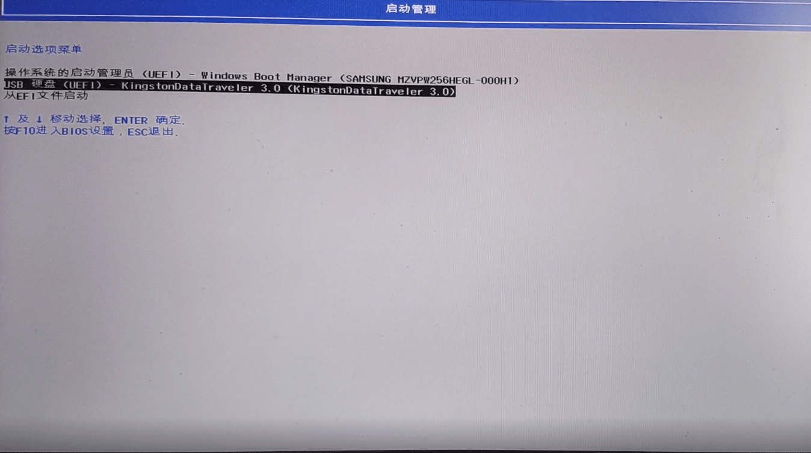
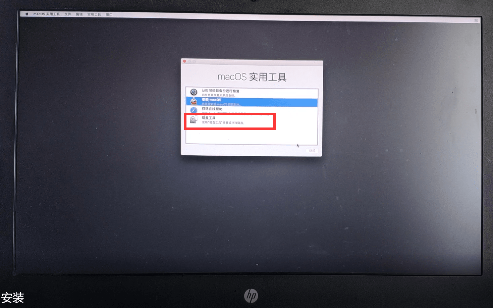
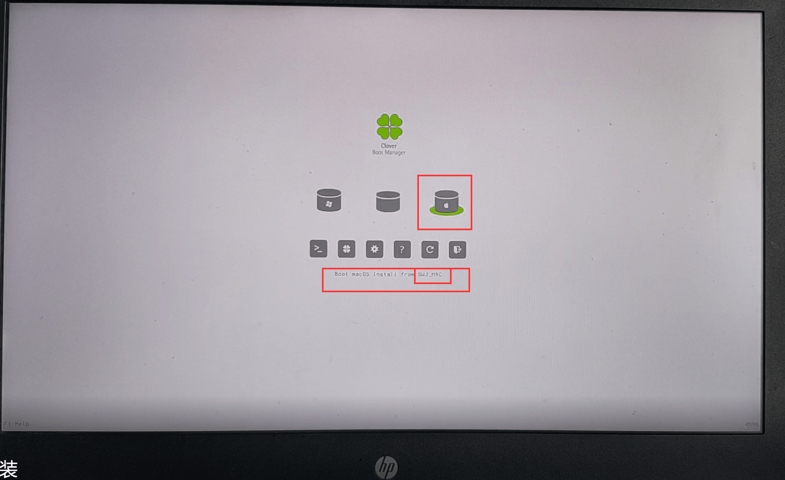

## 准备

> 视频教程已上传 [「Bilibili」](https://www.bilibili.com/video/BV1At411V7L9/)

**准备工作：**启动盘制作工具、`macOS`镜像文件、`DiskGenius`分区软件、电脑一台（最好是`Intel`平台的）、自己电脑的`EFI`文件（小米的笔记本比较好找，都是大神配置好的）
*黑苹果系统下载：*[**【点击跳转】**](http://mirrors.dtops.cc/iso/MacOS/daliansky_macos/) *这里我装的是`macOS High Sierra 10.13.6(17G2112) Installer with Clover 4606.dmg` *
黑苹果安装所需工具：[~~【点击下载】~~]()**（内含自用暗影精灵 2proEFI）**
<a href="https://github.com/ZGGSONG/HP-OMEN-15-ax214TX-Hackintosh" target="_blank"><b>github-efi</b></a>
**说明：**玩黑苹果，装系统是最简单的一步，配置`EFI`文件是最难的，所以能找到大神配置的`EFI`文件是最好的；其次黑苹果最好装在固态硬盘上面，否则体验极差

 - 制作启动盘【工具包中有】

添加镜像文件-选择插入的 U 盘-制作-等待完成即可
制作完成之后打开`DiskGenius`将 U 盘的`EFI/Clover`目录下的`config.plist`删除，找到自己电脑对应的核显型号的`config`文件，将其名字重命名为`config.plist`即可
查看显卡型号：

 - 分配磁盘空间（此处我分配了`80GB`的空间）

    安装系统当然需要给其分配一定的磁盘空间
    进入计算机管理界面（`右键此电脑-管理`）

右键所需要分配的磁盘-压缩（将空闲磁盘空间分出来一部分，大小 MB=（所需要分配大小（GB）*1024）MB）

右键此未分配磁盘空间-新建简单卷

**注意：此处要注意 EFI** 
所要安装的目的磁盘必须要有一个`>=200MB`的`EFI`分区，如果没有则需要手动创建（使用`DiskGenius`软件）：`打开软件-右键磁盘-新建 ESP/EFI 分区`
`（参考百度经验：https://jingyan.baidu.com/article/e3c78d649543d43c4c85f517.html）`

 - 进入 bios 关闭 security boot

    每台电脑都不尽相同，百度即可。
    一般操作：`关机-开机同时按电脑热键（惠普为 F10）-进入 bios-找到 security boot-Disable`即可

## 安装系统
`插入 U 盘-开机-同时按启动热键-选择制作好的 U 盘-进入`即可

等待其跑码：

抹掉磁盘就进行安装：

选择安装刚刚命名的磁盘即可，一直等待，中间会重启两到三次，重启时点击热键选择 U 盘启动即可，安装时重启会多一个磁盘，选择那个自己命名的磁盘即可成功安装

## 替换 EFI

成功安装进入系统之后，安装`clover`这款软件，打开挂载分区（这个分区为电脑的，可以拔出 U 盘，以防弄错），然后在将我工具包中的`efi`文件中的`clover`文件夹替换系统磁盘里面的`clover`文件夹即可

然后，关机，再开机即可，千万别点`重启`，血的教训。

这样就大功告成了，但是如果没有配置好的 EFI 文件，那只能自己一步步来吧（我当初应该弄了几个星期，上网爬贴，求教才弄好，所以想弄做好心理准备）
**推荐参考论坛或博客：远景论坛（下载需要注册，注册需要邀请码，某宝有卖）、黑果小兵的部落阁**

修复步骤大致为：`音频`、`分辨率`、`电源 dsdt`、`CPU 变频`、`显卡驱动`（10.14 以后的都不支持英伟达的显卡了，所以这里我装的是 10.13.6）

最后希望大家都能成功吃上黑苹果！

## 注意
**黑苹果安装好过后一般有如下几个问题：**

 1. 没有 WIFI（不兼容，可以上淘宝购买`外置 WIFI 模块`)
 2. 10.14 版本之后不支持英伟达的显卡驱动，所以想驱动上显卡，只能装 10.13 及以下版本，10.14 版本之后得禁用显卡，否则发热量巨大（针对笔记本）
 3. 装机完成无法热切换系统（重启按键不能用），例子：win 热切换到黑苹果，会`爆音`，当初本人戴着耳机，那酸爽。

