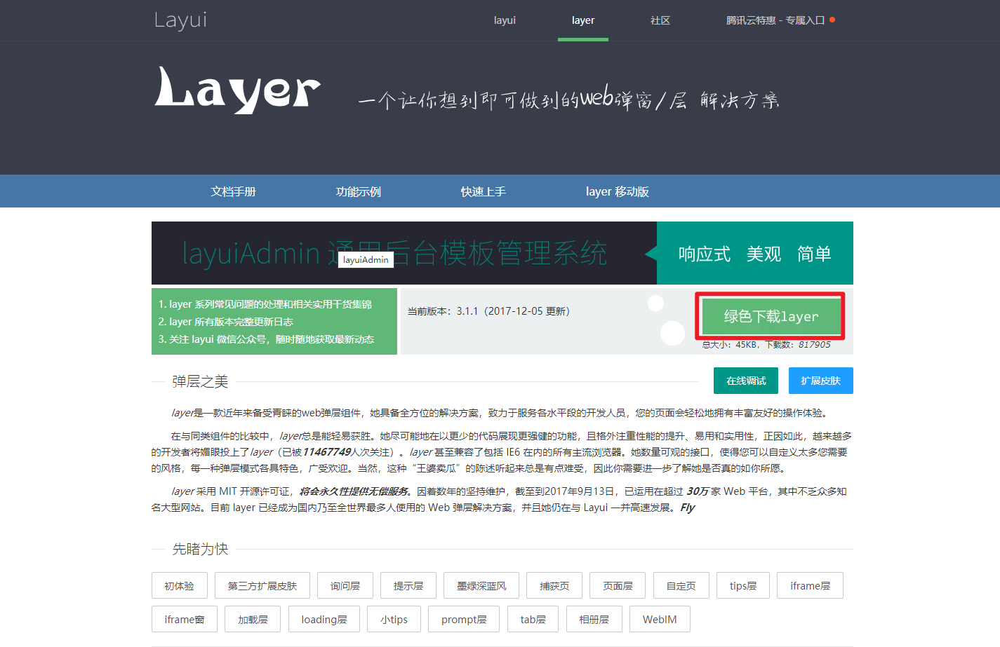
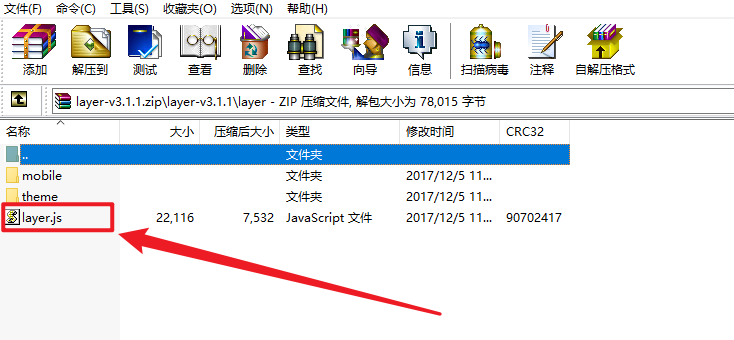

## 前言

原本在使用`handsome`主题的时候就在使用复制提醒，感觉在网站上复制内容没有提醒总感觉心里没底，不知道内容是否复制下来了，总是`win`+`v`(win)、`command`+`shift`+`v`(mac) 来查看，很麻烦。所以复制弹窗还是很有必要的。


效果一：

)

效果二：

)


> 个人感觉效果一不会有那么强的侵入感

## 效果一

> 这边使用的是 layer 的 web 弹层组件，详情查看 [layer 官网](https://layer.layui.com/)

依次进入`控制台 `-`外观`-`设置外观`-`主题自定义扩展`，将以下代码加入到`自定义 HTML 元素拓展`-`在 body 标签结束前`

```
<!-- 引入 layer.js, 也可以替换成别的源 -->
<script src="https://cdn.staticfile.org/layer/3.1.1/layer.js"></script>
<!-- 复制提醒 -->
<script>document.body.oncopy = function() {layer.msg('复制成功，若要转载请务必保留原文链接！');};</script>
```

可更换成其他源

官方 cdn 源
```txt
https://cdn.staticfile.org/layer/3.1.1/layer.js
```

jsdelivr 源
```txt
https://cdn.jsdelivr.net/gh/zggsong/cdn/blog/layer3.1.1.js

https://fastly.jsdelivr.net/gh/zggsong/cdn/blog/layer3.1.1.js
```

下载最新版官方 js 至服务器  
1.打开 [官网](https://layer.layui.com)  
2.点击下载  
3.上传至服务器  






## 效果二

> SweetAlert 可以替代 JavaScript 原生的 alert 和 confirm 的弹出提示框，它将提示框进行了美化。所以也可以设置复制弹窗提醒

1.依次进入`控制台 `-`外观`-`设置外观`-`主题自定义扩展`，将以下代码加入到`自定义 HTML 元素拓展`-`标签：head 头部 (meta 元素后）`

```javascript
<!-- 引入 sweetalert2 -->
<link rel="stylesheet" href="https://cdn.bootcss.com/sweetalert/1.1.3/sweetalert.min.css" />
<script type="text/javascript" src="https://cdn.bootcss.com/sweetalert/1.1.3/sweetalert.min.js"></script>
```


2.依次进入`控制台 `-`外观`-`设置外观`-`主题自定义扩展`，将以下代码加入到`自定义 HTML 元素拓展`-`在 body 标签结束前`

```javascript
<script>
    document.body.oncopy = function() {
        swal("复制成功！", "ZGGSONG 博客提醒您：若要转载请保留原文链接，感谢支持！", "success");
    };
</script>
```

## 参考
- [https://layer.layui.com](https://layer.layui.com)
- [https://sweetalert2.github.io](https://sweetalert2.github.io)
- [https://www.iiswz.com/post/10023.html](https://www.iiswz.com/post/10023.html)
- [https://harry0071.github.io/2018/02/08/sweetalert%E6%95%99%E7%A8%8B](https://harry0071.github.io/2018/02/08/sweetalert%E6%95%99%E7%A8%8B)
