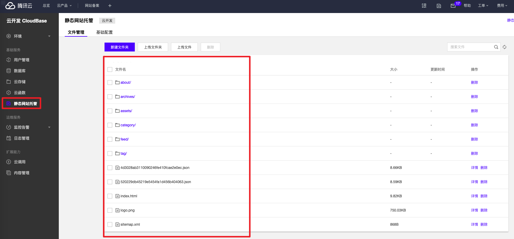

> wiki 下线 愚依旧以为每个人都要有自己的 wiki（或叫知识库） 所以尝试将各类琐碎知识记录在本地 wiki 中

## 前言

在日常学习过程中，知识细小琐碎，有时甚至只是一句话，却时常有很重要的学习意义，放在博客一方面日后查找起来不方便，另一方面就像 [风也 / KAYGB](https://blog.kaygb.com) 所说：小题大做了。既然是存储日常学习的琐碎知识，那么稳定就是重中之重了，所以 Github 就是首选了。


[AlanDecode](https://github.com/AlanDecode/) 大佬的主题 [VOID](https://github.com/AlanDecode/Typecho-Theme-VOID) 非常好看，还开发了一系列的插件及工具，而这款静态博客生成器 [Maverick](https://github.com/AlanDecode/Maverick/blob/master/README-zh_CN.md) 实际使用之后，感受十分良好，不过可能对新手不是那么友好，不像 hexo 等有非常丰富的新手教程，而针对~~~Maverick~~~（所有的程序）来说，仔细看源码能解决 __99%__ 的问题。同时 AlanDecode 也开发了一个 wiki 主题 [Kpeler](https://github.com/AlanDecode/Maverick-Theme-Kepler)，在 wiki 系统里面个人认为是{{很漂亮：qieshiyong}}的了。


## 搭建

> Maverick 是用的是 git actions 自动构建，这就很方便了，这就意味着你只需要完成一套 git 操作啥都不用做，网站就自动构建发布成功了，同时还集成了 Jsdeliver，一键开启，填写发布页面的`仓库名`+`分支名`即可实现 cdn 加速（虽然偶有抽风#（便便）不过问题不大）

首先`fork`[示例仓库](https://github.com/AlanDecode/Blog-With-GitHub-Boilerplate), 跟着`README`操作一遍就可以大体了解他的过程了，默认使用 [https://github.com/AlanDecode/Maverick-Theme-Galileo](https://github.com/AlanDecode/Maverick-Theme-Galileo)，适合作为个人博客站点，随后修改主题 [Kpeler](https://github.com/AlanDecode/Maverick-Theme-Kepler) 及其他内容即可，生成个人 wiki 站点。

如果想要深入了解 Maverick 的原理过程，请查看 [https://blog.imalan.cn/blog-now-powered-by-maverick](https://blog.imalan.cn/blog-now-powered-by-maverick)

> 一些个人踩过的坑，总之就是看文档看文档看文档！

Maverick 只是一款静态网页生成器，需要搭配主题（默认自带一款博客主题）使用，生成的静态网站文件都在`dist`（或 test_dist) 下

`python`版本要高于 3.5，而一般 python 都是 2.7 版本，所以需要使用`python3`，同理`pip3`。当然这只是对 Maverick 的一些说明

填写`token`时名字必须是`PERSONAL_TOKEN`（对，我就是那个不仔细看说明的人/ku）

发布至`*.github.io`要求必须是发布至`master`分支，只需要修改仓库名为`*.github.io`并且修改`.github/workflows/ci.yml`中发布分支名为`master`即可

读文档！！！修改发布分支名，勿忘修改 cdn 分支名

site_prefix: 
- 默认：site_prefix = "/Blog-With-GitHub-Boilerplate/"
- 网站：//*.github.io/Blog-With-GitHub-Boilerplate/
- 修改 1：site_prefix = "/"
- 网站：//*.github.io/
- 修改 2：site_prefix = "/wiki/"
- 网站：//*.github.io/wiki/


后期部署至腾讯云开发，国内访问速度大大提升

---

> 2022-09-18 更新，静态网站托管取消免费额度，已全面收费

## 部署腾讯云

由于腾讯云开发已经针对 git action 提供了扩展，直接使用即可：[https://github.com/marketplace/actions/tencent-cloudbase-github-action](https://github.com/marketplace/actions/tencent-cloudbase-github-action)

```
#只需要以下字符串
secret_Id
secret_Key
env_Id
```
获取 API 秘钥，访问 [https://console.cloud.tencent.com/cam/capi](https://console.cloud.tencent.com/cam/capi) 新建即可


控制台搜索进入`云开发 CloudBase`新建一个开发环境复制`env_Id`


填写`secret`


配置 action

[腾讯云开发参考示例](https://github.com/marketplace/actions/tencent-cloudbase-github-action#%E5%8F%82%E8%80%83%E7%A4%BA%E4%BE%8B)

将如下信息添加进`.github/workflows/ci.yml`末尾即可注意缩进
```
- name: Deploy static to Tencent CloudBase
  id: deployStatic
  uses: TencentCloudBase/cloudbase-action@v1.1.0
  env:
    PERSONAL_TOKEN: ${{ secrets.PERSONAL_TOKEN }}
    PUBLISH_BRANCH: gh-pages
    PUBLISH_DIR: ./dist
  with:
    secretId: ${{ secrets.SECRET_ID }}
    secretKey: ${{ secrets.SECRET_KEY }}
    envId: ${{ secrets.ENV_ID }}
    staticSrcPath: dist
```
等待 action 自动构建，完成后即可在腾讯云开发后台看到如下界面



最后在腾讯云开发绑定域名即可


> 部署至腾讯云开发参考 [风也 / KAYGB-使用 GitHub Action 自动部署 WIKI 站点（Maverick）至腾讯云开发](https://blog.kaygb.com/194.html)

> 非*.github.io 仓库部署 git pages 和腾讯云开发

那么这就需要在 git pages 和腾讯云之间选择一个，因为`site_prefix`的问题，若是`/`则可以成功部署在腾讯云开发，否则仅可在 git pages 上成功访问

> 提取 typecho 博客 .md 文件
`wiki`可以让我们细化添加我们以前记录的内容，方便查找再学习巩固，[Tp2MD](https://github.com/AlanDecode/Typecho-Plugin-Tp2MD) 这款插件可以直接提取出`typecho`博客所有的 md 文件，方便整理与保存
